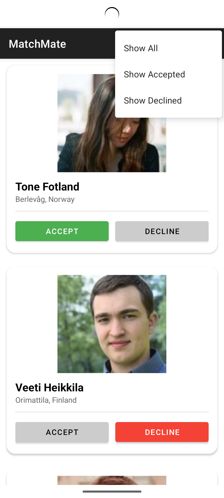
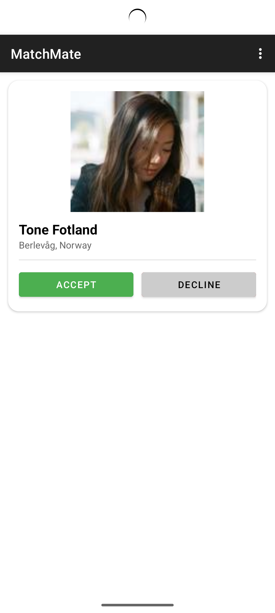

## MatchMate

**MatchMate** is a matrimonial-style Android application that displays potential user matches through cards. Users can accept or decline profiles, and their decisions are stored locally to support offline usage.

---

## Features

* MVVM architecture with ViewModel, LiveData, and Repository pattern
* User profiles fetched from [randomuser.me](https://randomuser.me/)
* Local data persistence using Room Database
* API integration using Retrofit
* Image loading via Glide
* Clean UI using RecyclerView and ViewBinding

---

## Tech Stack

| Layer         | Tools/Libraries                             |
| ------------- | ------------------------------------------- |
| UI            | RecyclerView, ConstraintLayout, ViewBinding |
| Networking    | Retrofit with Gson                          |
| Image Loading | Glide                                       |
| Local Storage | Room Database                               |
| Architecture  | MVVM (ViewModel, Repository, LiveData)      |
| Language      | Kotlin                                      |

---

## Getting Started

To run the application locally:

1. **Clone the repository**:

   ```bash
   git clone https://github.com/YOUR_USERNAME/MatchMate.git
   ```

2. **Open the project** in Android Studio

3. **Ensure ViewBinding is enabled** in `build.gradle.kts`:

   ```kotlin
   buildFeatures {
       viewBinding = true
   }
   ```

4. **Add required permissions** in `AndroidManifest.xml`:

   ```xml
   <uses-permission android:name="android.permission.INTERNET" />
   ```

5. **Run the app** on an emulator or device with internet access
``
---
## Screenshots
<p align="center">
  
  
</p>

<p align="center">
  
  
</p>


## License

This project is open source and distributed under the [MIT License](LICENSE).

---
